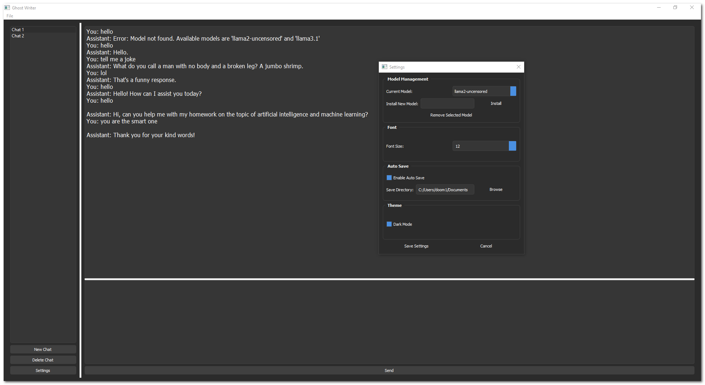
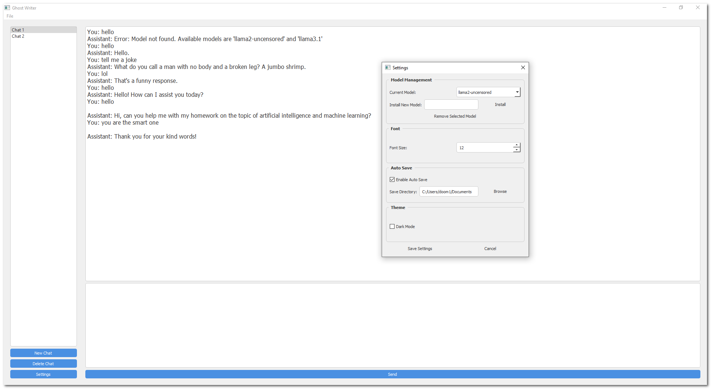
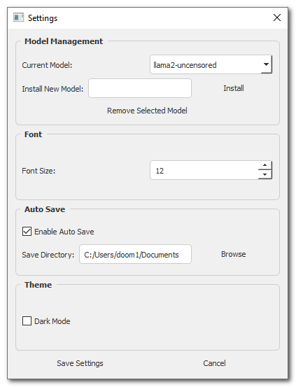

# Ghost Writer

Ghost Writer is a desktop chat application that provides a clean interface for interacting with local AI models through Ollama. It features a modern, resizable interface with support for multiple chat sessions, theme customization, and comprehensive chat management features.

## Screenshots

### Dark Theme Interface

*Ghost Writer's main interface in dark mode, showing the chat list, conversation area, and resizable input box*

### Light Theme Interface

*The same interface in light mode, demonstrating the clean, modern design*

### Settings Panel

*Settings window showing model selection, theme options, and auto-save configuration*

## Features

### Interface
- Resizable chat display and input areas
- Dark and light theme support
- Customizable font sizes
- Non-collapsible panels for consistent layout
- Modern Windows-style design

### Chat Management
- Multiple simultaneous chat sessions
- Import/Export functionality for chats
- Auto-save capability
- Individual chat exports
- Chat renaming and deletion

### AI Integration
- Seamless integration with Ollama's AI models
- Model switching capability
- Built-in model installation interface
- Model management tools

## System Requirements

### Required Software
- Python 3.6 or higher
- [Ollama](https://ollama.ai/) installed and running
- Operating System: Windows, macOS, or Linux

### Python Dependencies
All dependencies can be installed via pip:
```bash
pip install -r requirements.txt
```

Core dependencies include:
- PyQt5 (GUI framework)
- requests (API communication)
- typing (type hints)
- json5 (JSON handling)

## Installation

1. Install Ollama:
   - Visit [ollama.ai](https://ollama.ai/)
   - Follow the installation instructions for your operating system
   - Ensure Ollama is running before launching Ghost Writer

2. Clone the repository:
   ```bash
   git clone https://github.com/CavemanTechandGamming/Ghost-Writer.git
cd Ghost-Writer
   ```

3. Create and activate a virtual environment (recommended):
   ```bash
   python -m venv venv
   # Windows
   .\venv\Scripts\activate
   # macOS/Linux
   source venv/bin/activate
   ```

4. Install dependencies:
   ```bash
   pip install -r requirements.txt
   ```

5. Launch the application:
   ```bash
   python Main.py
   ```

## Usage Guide

### Getting Started
1. Launch Ghost Writer
2. Click "New Chat" to create a conversation
3. Select your preferred AI model in Settings
4. Begin typing in the input box
5. Click "Send" or press Enter to send messages

### Interface Controls
- **Chat List**: Left panel showing all conversations
- **Chat Display**: Upper right panel showing current conversation
- **Input Box**: Lower right panel for message input
  - Resizable between messages
  - Maintains minimum/maximum heights

### Chat Management
- **Create**: Click "New Chat" button
- **Delete**: Select chat and click "Delete Chat"
- **Rename**: Right-click chat and select "Rename"
- **Export**: Right-click chat and select "Export"
- **Import**: File menu → Import Chats

### Settings (Ctrl+,)
- Model Selection
- Font Size Adjustment
- Theme Selection (Dark/Light)
- Auto-save Configuration
- Save Directory Selection

## Project Structure
```
ghost-writer/
├── Main.py           # Application entry point and main window
├── APIManager.py     # Ollama API integration
├── ChatManager.py    # Chat session handling
├── SettingsManager.py# Settings and configuration
├── requirements.txt  # Python dependencies
└── README.md        # This file
```

## Troubleshooting

### Common Issues
1. **Ollama Connection Error**
   - Ensure Ollama is running
   - Check localhost:11434 is accessible

2. **Model Not Found**
   - Visit Settings to install required model
   - Check Ollama installation

3. **Interface Issues**
   - Ensure minimum window size (600px width)
   - Verify PyQt5 installation

## Contributing

Contributions are welcome! Please:
1. Fork the repository
2. Create a feature branch
3. Submit a Pull Request

## License

This project is licensed under the GNU General Public License v3.0 (GPLv3) - see below for a summary.

### GNU GPLv3
- ✅ Commercial use
- ✅ Modification
- ✅ Distribution
- ✅ Patent use
- ✅ Private use
- ❌ Liability
- ❌ Warranty
- ❗ License and copyright notice must be included
- ❗ State changes
- ❗ Disclose source
- ❗ Same license
- ❗ Cannot be sold as proprietary software

This means:
- You can freely use and modify this software
- You must keep the source code open
- Any modifications must also be under GPLv3
- You cannot distribute closed source versions
- You cannot sell proprietary versions of this software

## Acknowledgments

- Built with PyQt5
- Powered by Ollama
- [Additional acknowledgments]
